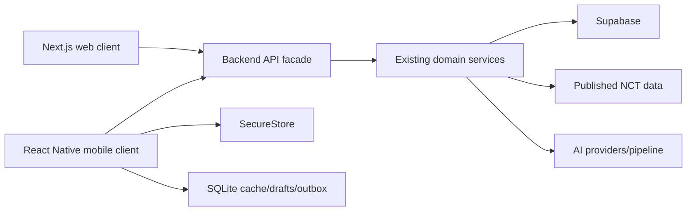

# Product and Architecture

## Product model

NCT Navigator helps a user turn profile/interests into a trusted NCT goal and then work toward it through interview, plan and Coach experiences.

The canonical product sequence is:

```text
profile context
  -> interest selection
  -> constrained recommendation pipeline
  -> one selected goal
  -> interview
  -> generated plan
  -> Coach roadmap and daily work
```

Community chat, AI Teacher, profile history, achievements and bookmarks support this path. They do not replace it.

## Target component model



## Repository target

```text
src/                  existing web client
backend/              existing backend
mobile/               new native client
packages/contracts/   shared wire contracts and pure types
mobile_version_md/    canonical migration instructions
```

Do not move the existing web application under a new monorepo structure merely to make the tree symmetrical. Introduce only the minimum workspace/package configuration needed to share contracts reliably.

## Ownership boundaries

### Backend owns

- NCT release/read-model truth;
- recommendation and scoring rules;
- AI orchestration and validation;
- user authorization;
- goal, plan and Coach persistence;
- server-side chat membership and media authorization;
- maintenance state;
- conflict resolution that affects server records.

### Mobile owns

- native presentation and navigation;
- touch, keyboard, safe-area and accessibility behavior;
- local drafts/cache/outbox;
- network retry orchestration within contract rules;
- secure token persistence;
- device permissions and integrations;
- local observability breadcrumbs that contain no secrets.

### Shared contracts own

- request/response DTOs;
- Zod validation schemas safe for both runtimes;
- stable error codes;
- pagination and stream event shapes;
- identifiers and enums whose semantics are shared.

## Native navigation

Recommended root tabs:

1. Home: active goal, next action, daily progress.
2. Navigator: onboarding, interests, recommendations, interview.
3. Coach: roadmap, daily plan, diagnostics and Coach chat.
4. Community: conversations and messages.
5. Profile: plans, bookmarks, history, achievements and settings.

AI Teacher stays inside help/Coach tooling. Marketing landing, features and how-it-works remain on the web.

## Explicit non-goals

- No WebView-based core application.
- No complete backend rewrite.
- No duplicated recommendation engine in mobile.
- No full offline AI.
- No bulk migration of every web page before the vertical slice.
- No speculative native modules without a demonstrated need.
- No service-role key, AI key or backend secret in the app.
- No fake loading progress.
- No silent changes to the goal/interview/plan order.

## Architecture gates

- A mobile feature must identify its backend or local source of truth.
- Every persisted record must have an owner, version and invalidation rule.
- Every retried mutation must define idempotency behavior.
- Every background/realtime feature must define reconnect and termination behavior.
- Every shared module must be free of platform-only imports.
